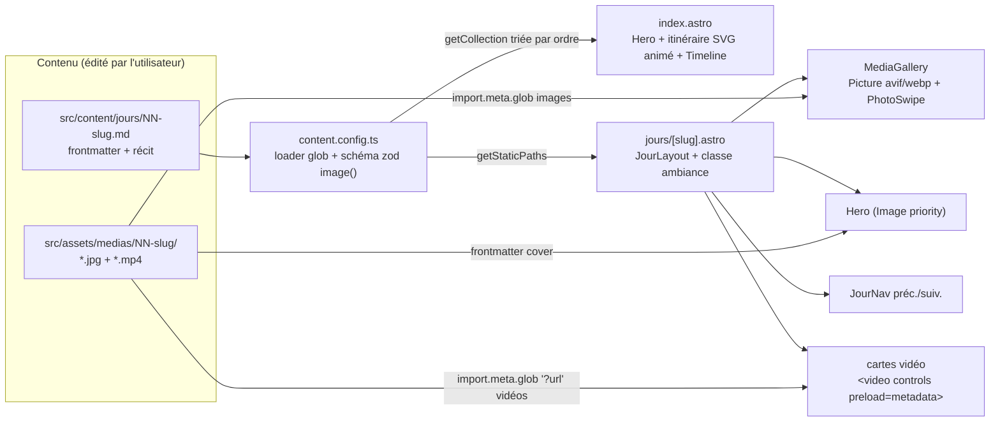

# Site souvenirs de vacances — Futuroscope & Poitiers (25 juillet → 1er août)

## Contexte

Dépôt quasi vide (`/home/user/repo`, un seul commit d'init) — implémentation dans cette session distante, branche poussée + PR ; l'utilisateur récupère ensuite le code en local. Site statique de souvenirs de vacances : **8 jours**, road trip Lyon→Poitiers en Tesla, Poitiers/Sensas, Futuroscope (3 jours, hôtel Cosmos, Aquascope), Clos de la Ribaudière/SPA, Vallée des Singes, retour. Objectif : revivre le périple de façon immersive — effets de scroll type Apple **et** touches originales (esprit croisiere2018.wulfy.eu / portugal.wulfy.eu modernisé), **une ambiance visuelle propre à chaque jour**, galeries riches (**10-20+ photos par jour, vidéos incluses**).

**Décisions validées :** Astro statique pur, accueil timeline + une page par jour, Markdown sans backoffice, médias dans des dossiers conventionnés, public sans auth, déploiement Coolify (Dockerfile node→nginx), domaine placeholder `site` à changer avant déploiement.

**Versions vérifiées sur npm (2026-08-02) :** `astro@7.1.6` (Node ≥ 22.12), `photoswipe@5.4.4`. Changelog Astro v6/v7 audité (docs.astro.build bloqué par le proxy de la session ; changelog lu via GitHub raw).

### Ajustements imposés/permis par Astro 7 (vs draft initial basé v5)

- **Zod** : `z` importé depuis `astro/zod` (export via `astro:content` déprécié en v6). Loader `glob` et helper `image()` inchangés et stables.
- **Fonts** : API Fonts native stable (option top-level `fonts` + `fontProviders`) — utilisée **à la place des paquets @fontsource** : téléchargement au build, auto-hébergement, préload et fallback générés. `<Font cssVariable="--font-titres" preload />` (import `astro:assets`) dans le `<head>`.
- **Images responsives** : stables — `image: { responsiveStyles: true, layout: 'constrained' }`, props `layout` / `priority` sur `<Image>`/`<Picture>`.
- **CSP** : `security.csp` stable et compatible nativement avec les images responsives → CSP à base de hashes émise par Astro en `<meta>` (zéro `unsafe-inline`). nginx ne porte que `frame-ancestors` (ignoré en `<meta>`) + les autres headers.
- **Markdown** : rendu par Sätteri (pipeline natif v7, remplace remark/rehype). CommonMark + images relatives optimisées : OK pour notre usage ; pas de plugins remark/rehype.
- **Divers v7** : `compressHTML: 'jsx'` par défaut (écrire `{" "}` pour préserver un espace inter-éléments) ; `astro dev` se détache automatiquement quand un agent IA est détecté.

## Les 8 jours — itinéraire réel et ambiances

| # | Fichier (id = dossier médias) | Date | Contenu | Ambiance (accent + motif) |
|---|---|---|---|---|
| 1 | `01-road-trip-tesla` | sam. 25/07 | Road trip Lyon→Poitiers en Tesla Model 3 noire 2023 (test de l'électrique), arrivée hôtel Mercure Poitiers | Rouge Tesla `#e82127` sur noir asphalte ; ligne de route pointillée qui défile, tracé d'itinéraire animé |
| 2 | `02-sensas-poitiers` | dim. 26/07 | Hôtel Mercure, Sensas Poitiers (parcours sensoriel) | Orange `#fb923c`, dégradé sombre chaleureux ; motif « sens » (ondes, braille-dots), reveals à l'aveugle (flou→net) |
| 3 | `03-futuroscope` | lun. 27/07 | Arrivée hôtel Cosmos, journée d'attractions au Futuroscope | Cyan électrique `#22d3ee` ; grille néon futuriste, glow |
| 4 | `04-futuroscope-aquascope` | mar. 28/07 | Petit-déj Space Loop, journée Futuroscope, Aquascope 17h–22h | Violet spatial `#8b5cf6` virant bleu profond `#3b82f6` en bas de page ; étoiles puis bulles montantes |
| 5 | `05-futuroscope-dernier-jour` | mer. 29/07 | Dernier jour au Futuroscope | Magenta `#ec4899` ; ambiance spectacle nocturne/aurora |
| 6 | `06-clos-de-la-ribaudiere-spa` | jeu. 30/07 | Arrivée au Clos de la Ribaudière, SPA | Vert sauge `#34d399` + touches or ; vapeur/ondulations lentes, rythme apaisé |
| 7 | `07-vallee-des-singes` | ven. 31/07 | Vallée des Singes | Vert jungle `#22c55e` ; feuillage en parallax |
| 8 | `08-retour-lyon` | sam. 01/08 | Retour à Lyon | Ambre coucher de soleil `#f59e0b` ; route du retour, générique de fin |

L'ambiance est pilotée par 2 champs frontmatter : `accent` (couleur → `--accent`) et `ambiance` (slug → classe CSS `ambiance-route|sens|futur|space-aqua|nocturne|spa|jungle|sunset` qui active dégradé de fond du hero, motif décoratif en couche fixe et variantes d'animation). Tout est en CSS (couches `::before`/`::after` + `background`), pas de lib.

## Architecture



### Arborescence

```
├── astro.config.mjs          site placeholder, image responsive, fonts, security.csp
├── package.json / tsconfig.json / .nvmrc (22)
├── Dockerfile / nginx.conf / .dockerignore
├── README.md
├── public/favicon.svg
└── src/
    ├── content.config.ts
    ├── content/jours/        01-road-trip-tesla.md … 08-retour-lyon.md  ← placeholders (cf. tableau)
    ├── assets/medias/<id-du-jour>/   ← photos .jpg/.png/.webp ET vidéos .mp4/.webm
    ├── layouts/  BaseLayout.astro, JourLayout.astro
    ├── components/  Hero, Itineraire (SVG animé), Timeline, TimelineCard, MediaGallery, JourNav, Footer
    ├── scripts/  reveal-fallback.ts (IntersectionObserver ~30 l.), lightbox.ts (PhotoSwipe import dynamique)
    ├── styles/  tokens.css, global.css, ambiances.css
    └── pages/  index.astro, jours/[slug].astro, 404.astro
```

**Convention clé** : nom du dossier médias = id du fichier Markdown (`03-futuroscope.md` ↔ `medias/03-futuroscope/`). Ajouter un jour = un `.md` + un dossier. Préfixe numérique = ordre ; médias triés par nom de fichier, photos et vidéos mélangeables dans la grille (ordre = nom).

### astro.config.mjs

```js
import { defineConfig, fontProviders } from 'astro/config';

export default defineConfig({
  site: 'https://site.example',           // ← placeholder, à changer avant déploiement
  image: { responsiveStyles: true, layout: 'constrained' },
  fonts: [
    { provider: fontProviders.fontsource(), name: 'Space Grotesk', cssVariable: '--font-titres' },
    { provider: fontProviders.fontsource(), name: 'Inter', cssVariable: '--font-corps' },
  ],
  security: { csp: { /* directives: img-src 'self' data:, media-src 'self', etc. */ } },
});
```

### Content collection (`src/content.config.ts`)

Loader `glob` sur `src/content/jours`, schéma zod (`z` depuis `astro/zod`) avec `image()` :

```yaml
---
titre: "Le Futuroscope"
sousTitre: "Une journée dans le futur"
date: 2026-07-27
lieu: "Chasseneuil-du-Poitou"
hotel: "Hôtel Cosmos"                 # optionnel
emoji: "🎢"
cover: "../../assets/medias/03-futuroscope/01-entree.jpg"
coverAlt: "L'entrée du Futuroscope"
ordre: 3
accent: "#22d3ee"
ambiance: "futur"                     # optionnel, cf. tableau des ambiances
lieux:                                # optionnel — sections par lieu dans la page
  - titre: "Hôtel Cosmos"
    image: "../../assets/medias/03-futuroscope/ambiance-cosmos.jpg"
    imageAlt: "La façade colorée de l'hôtel Cosmos"
  - titre: "Le Futuroscope"
    image: "../../assets/medias/03-futuroscope/ambiance-futuroscope.jpg"
    imageAlt: "Le Kinémax et son architecture cristalline"
---
Récit en Markdown, photos inline optimisées automatiquement :


## Hôtel Cosmos
Le récit de l'arrivée à l'hôtel…

## Le Futuroscope
Le récit de la journée d'attractions…
```

### Sections par lieu (plusieurs lieux dans une même journée)

- **Convention d'écriture** : chaque `## Titre` du récit ouvre une section-lieu. Si le titre correspond à une entrée `lieux[]` du frontmatter (comparaison insensible casse/accents), la section démarre par une **bannière d'ambiance immersive** : image plein largeur (~60svh, `<Image>` optimisée, parallax léger via scroll-driven animation, dégradé vers le fond) avec le titre du lieu en overlay. Un `##` sans entrée `lieux[]` reste un titre simple — la fonctionnalité est entièrement optionnelle.
- **Implémentation** dans `JourLayout` : récupération du HTML rendu de l'entrée, découpage sur les `<h2>` (les ids générés par Astro servent de clés de correspondance), interleaving avec les bannières, injection via `set:html`. Pas de MDX nécessaire, le contenu reste du Markdown pur.
- **Images d'ambiance** : nommées `ambiance-*.jpg` dans le dossier médias du jour — **exclues de la galerie** (comme la cover). Le réseau de cette session bloque les banques d'images (Wikimedia/Unsplash/Pexels testés) : les bannières seront livrées avec des **placeholders stylisés générés** (sharp, dégradé aux couleurs de l'ambiance + nom du lieu), et le README contiendra un **tableau de propositions d'images réelles par lieu** (liens de recherche Wikimedia Commons/Unsplash précis : Kinémax, Aquascope, Sensas, hôtels Mercure/Cosmos/Clos de la Ribaudière, Vallée des Singes, Tesla Model 3/A10) avec rappel des licences (préférer libre de droits ; attribution en footer si CC-BY). L'utilisateur télécharge et remplace.
- Jours multi-lieux typiques : jour 1 (départ Lyon / la route / Mercure), jour 2 (Mercure / Sensas), jour 4 (Space Loop / Futuroscope / Aquascope), jour 6 (Clos de la Ribaudière / SPA).

### Pipeline médias (photos + vidéos, 10-20+ par jour)

- **MediaGallery.astro** : `import.meta.glob('/src/assets/medias/**/*.{jpg,jpeg,png,webp}', { eager: true })` pour les photos (métadonnées + optimisation) et `import.meta.glob('/src/assets/medias/**/*.{mp4,webm}', { eager: true, query: '?url' })` pour les vidéos (URL Vite, pas de transcodage). Filtré par id du jour, trié par nom, cover et fichiers `ambiance-*` exclus.
- **Grille dense adaptée au volume** : grille responsive type justified/masonry (CSS `grid` + `grid-auto-flow: dense`, ratios préservés), 1 col mobile → 3-4 cols desktop, `loading="lazy"` partout — pensée pour 10-20+ éléments sans pagination.
- Photos : `<Picture formats={['avif','webp']} widths={[400,800,1600]} loading="lazy">` ; hero en `<Image layout="full-width" priority>` (LCP).
- Vidéos : cartes `<video controls playsinline preload="metadata">` dans la grille (badge ▶ ; lecture en place, plein écran natif mobile). Pas de poster à générer : `preload="metadata"` affiche la première frame.
- Lightbox **PhotoSwipe 5** sur les photos (pinch/swipe), import dynamique au premier clic → 0 Ko au chargement ; `data-pswp-width/height` via `ImageMetadata`. (PhotoSwipe manipule les styles via CSSOM → compatible CSP stricte.)
- Médias versionnés dans git. **README : recommander de compresser les vidéos (~720p/1080p H.264) et signaler l'option git-lfs si le repo devient lourd** — pas de LFS par défaut.
- Placeholders de démo : images générées localement via sharp (SVG dégradé aux couleurs de l'ambiance + texte → .jpg), 3-4 par jour + **1 mini-clip mp4 de 2 s généré avec le ffmpeg embarqué** (`/opt/pw-browsers/ffmpeg-1011`) pour valider le circuit vidéo. Pas de téléchargement (réseau restreint).

### Effets — CSS natif type Apple + touches originales

- **CSS scroll-driven animations** (`animation-timeline: view()/scroll()`) : hero sticky qui scale/dim, reveals décalés (`animation-range`), parallax léger des motifs d'ambiance — 0 Ko JS. Support 2026 : Chrome/Edge/Firefox/Safari 26.
- **Signature « périple » (l'original)** : sur l'accueil, itinéraire SVG stylisé Lyon→Poitiers dont le tracé se dessine au scroll (`stroke-dashoffset` piloté par `animation-timeline: scroll()`), la timeline des 8 jours s'accrochant le long du tracé. Réutilisé en mini sur le jour 1 (route qui défile) et le jour 8 (sens inverse).
- **Ambiances par jour** (`ambiances.css`) : chaque slug active dégradé du hero, motif décoratif fixe (étoiles, bulles, feuillage, vapeur… en CSS pur) et variantes de timing — cf. tableau.
- Fallback `IntersectionObserver` (~30 lignes) derrière `@supports not (animation-timeline: view())`.
- `prefers-reduced-motion: reduce` → tout désactivé (animations et motifs animés).

### Composants

- **Hero** : 100svh, cover plein écran, dégradé d'ambiance, titre + emoji + date + lieu + hôtel en cascade, effet sticky (le contenu remonte par-dessus).
- **Itineraire** : SVG animé de l'accueil (cf. ci-dessus).
- **Timeline** (accueil) : une carte par jour (`getCollection` triée par `ordre`) — cover, emoji, date, teaser — en reveal le long du tracé.
- **JourLayout** : Hero → article prose (texte + photos inline) → MediaGallery → JourNav (préc./suiv., grandes cartes avec mini-cover) → Footer. Classe `ambiance-*` posée sur `<body>`.

### Direction artistique

- **Dark** : fond `#0a0e1a`, texte `#e8eaf2` ; accents par jour (cf. tableau) injectés en `--accent`.
- Typo via API Fonts native : **Space Grotesk** titres, **Inter** corps, tailles en `clamp()`.
- Mobile-first : `100svh`, cibles ≥ 44px, grille 1 colonne par défaut.

## Déploiement Coolify

`Dockerfile` multi-stage : `node:22-alpine` (`npm ci` + `astro build` — le build télécharge les polices via l'API Fonts, réseau requis comme pour npm ci) → `nginx:alpine` (dist + conf). Coolify : ressource « Dockerfile », port 80, TLS via Traefik/Let's Encrypt.

`nginx.conf` : gzip, `error_page 404 /404.html`, cache immutable sur `/_astro/`, **support des Range requests pour les vidéos (défaut nginx, ne pas le casser)**, headers :
- `Content-Security-Policy: frame-ancestors 'none'` (seule directive côté nginx — le reste, avec hashes script/style, est émis par Astro en `<meta>`)
- `X-Content-Type-Options: nosniff`, `Referrer-Policy: strict-origin-when-cross-origin`, `Permissions-Policy` restrictive

## Séquencement

1. Scaffold : `npm create astro@latest . -- --template minimal --no-git -y` + `photoswipe` + `@astrojs/check`/`typescript` ; `astro.config.mjs` complet ; `tokens.css`/`global.css`/`BaseLayout` (avec `<Font />`) ; `.nvmrc`
2. `content.config.ts` (avec `lieux[]`) + 8 jours placeholder (tableau ci-dessus : titres, dates, lieux, hôtels, accents, ambiances réels ; récits placeholder avec sections `##` par lieu) + script one-shot sharp/ffmpeg générant les médias d'exemple (photos, bannières `ambiance-*`, mini-clip vidéo)
3. `index.astro` + Itineraire (SVG animé) + Timeline/TimelineCard
4. `jours/[slug].astro` + JourLayout (découpage en sections-lieux + bannières d'ambiance) + Hero + prose stylée
5. MediaGallery (photos + vidéos) + lightbox PhotoSwipe
6. `ambiances.css` (8 ambiances) + effets scroll + fallback IO + reduced-motion
7. JourNav, Footer, 404, SEO (OG image = cover)
8. Dockerfile + nginx.conf + .dockerignore
9. README : ajouter un jour / des médias (conseils compression vidéo), sections par lieu + tableau de propositions d'images d'ambiance à télécharger (liens précis + licences), changer le domaine, déployer sur Coolify

## Vérification (adaptée à la session distante)

1. `npx astro check` — types + schémas de collection
2. `npm run build && npm run preview` — build complet ; `curl` des pages : `<meta>` CSP présent, srcset avif/webp, préload des polices, `<video>` avec URL `_astro` valide
3. Screenshots Playwright (Chromium préinstallé : `/opt/pw-browsers/chromium`) mobile + desktop : accueil (itinéraire + timeline), une page jour par ambiance contrastée (1, 4, 6) avec bannières de sections-lieux, galerie dense, lightbox ouverte
4. Lighthouse mobile (`CHROME_PATH=/opt/pw-browsers/chromium`) sur le preview : Perf ≥ 90, A11y ≥ 95, LCP = hero, CLS = 0
5. **Docker : daemon indisponible dans cette session** → Dockerfile/nginx.conf relus + test `docker build` / `curl -I` (headers) documenté dans le README pour exécution locale par l'utilisateur
6. Test manuel mobile (utilisateur, post-merge) : reveals, lightbox pinch/swipe, lecture vidéo, reduced-motion

## Reste à fournir par l'utilisateur (après implémentation)

- Vraies photos/vidéos dans `src/assets/medias/<jour>/`, récits dans `src/content/jours/*.md`
- Images d'ambiance réelles des lieux (`ambiance-*.jpg`) à télécharger depuis les liens proposés dans le README (le réseau de la session de build bloque les banques d'images)
- Domaine définitif dans `astro.config.mjs` (`site:`) avant déploiement
- Test Docker local (commandes dans le README)
