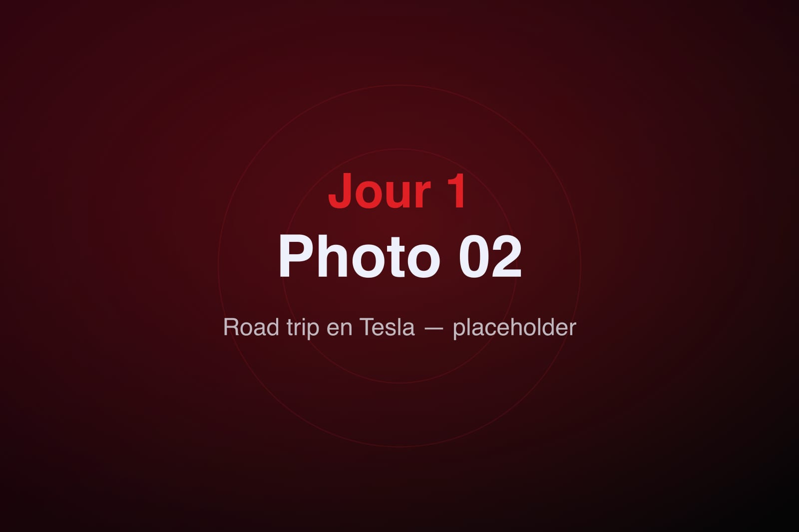

Le grand jour est arrivé. Après des mois à cocher les cases d'un tableur partagé, le coffre se remplit enfin et la Tesla Model 3 noire de 2023 nous attend, silencieuse, le long du trottoir. C'est notre premier vrai voyage en électrique : un test grandeur nature autant qu'un départ en vacances.

## Départ de Lyon

Six heures du matin, la ville dort encore. On charge les valises pendant que l'écran central affiche l'itinéraire complet jusqu'à Poitiers, arrêts recharge inclus. Le calme de l'habitacle au démarrage a quelque chose de déroutant : pas de vrombissement, juste le glissement des pneus sur l'asphalte humide.

On quitte Lyon par l'ouest, le soleil dans le dos, la journée entière devant nous.

## La route

L'A89 puis l'A20 déroulent leurs rubans à travers le Limousin. On teste l'Autopilot sur les longues portions, on surveille l'autonomie, on apprend le rythme particulier du voyage électrique : rouler, recharger, marcher un peu, repartir.

La pause recharge devient vite un rituel plutôt qu'une contrainte. Vingt minutes à un Superchargeur, le temps d'un café et de se dégourdir les jambes, et la batterie repart à pleine forme.

## Hôtel Mercure

En fin d'après-midi, Poitiers apparaît enfin. L'hôtel Mercure nous accueille pour deux nuits, base idéale pour explorer la région. On pose les valises, épuisés mais ravis : le pari de l'électrique est tenu, et l'aventure ne fait que commencer.
