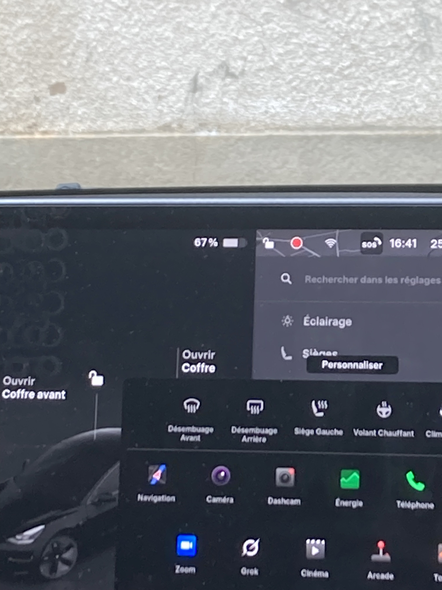
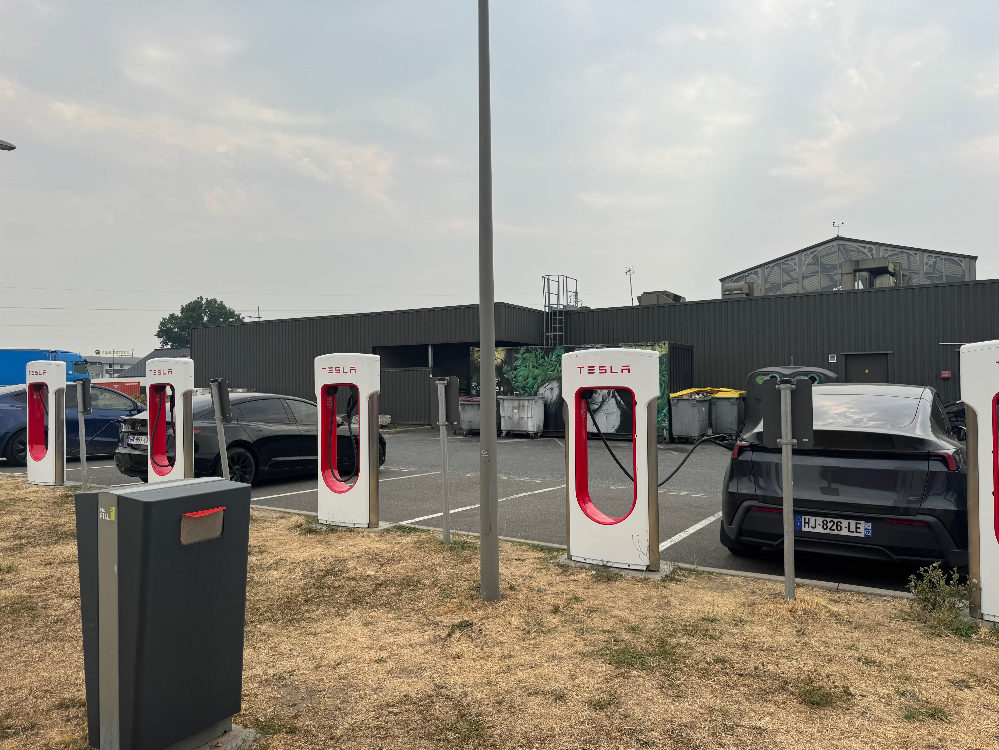
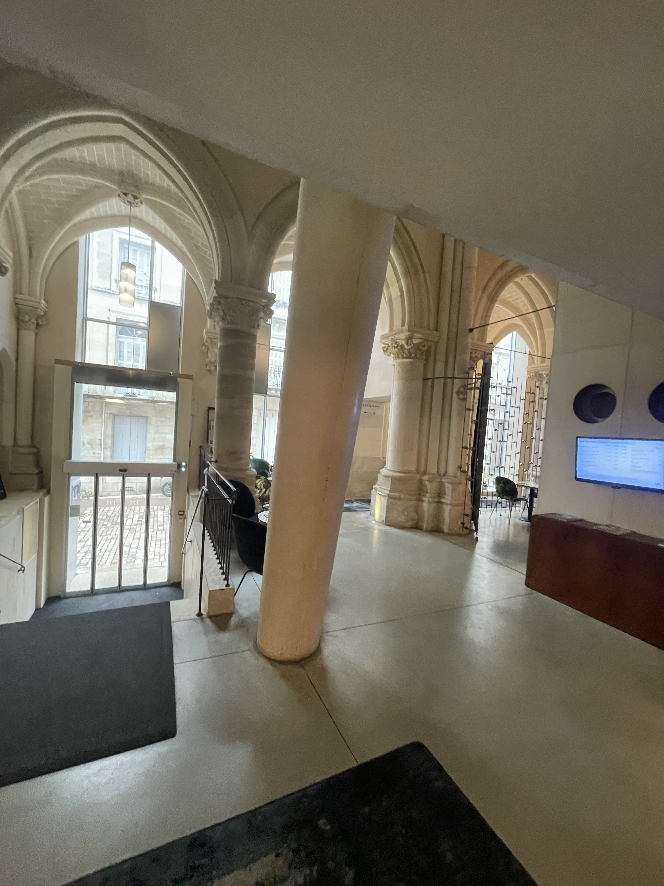
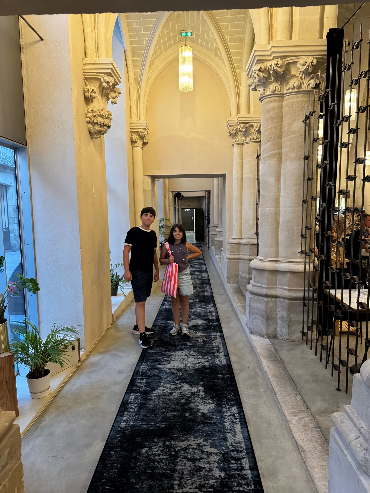
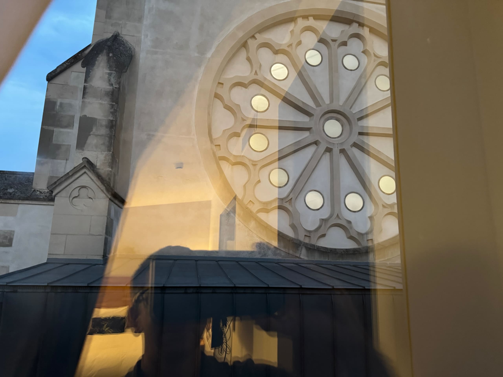
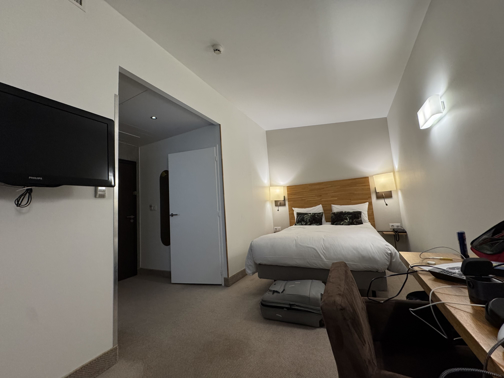
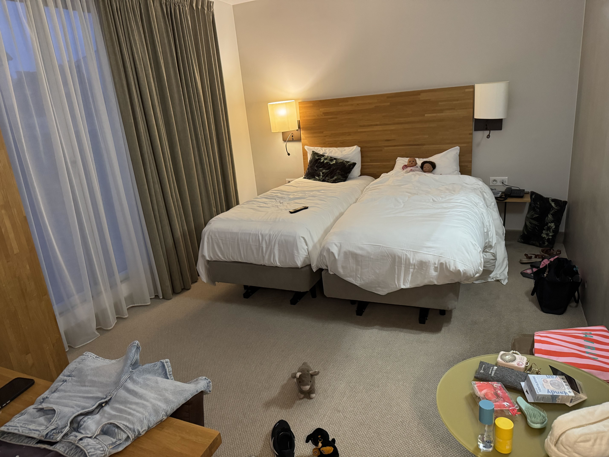

Le grand jour est arrivé. Après des mois à chercher une tesla et un faux bon quelques semaines avant par la location Carrefour, on trouve 1 mois avant le départ une location via "Getaround". Rendez-vous est pris à 9h00 à Lyon Vaise. Bien entendu le bus qui devait m'emmener est annulé et j'arrive à 9:45. Le temps de faire le tour de la voiture avec "Loïc" (le propriétaire) et prendre les recommendations sur le fonctionnement de la voiture et c'est parti ! Direction la grand-mère qui garde les petits le temps que je récupère la voiture. C'est notre premier vrai voyage en électrique : un test grandeur nature autant qu'un départ en vacances

## Départ de Lyon

J'arrive vers 10h15 , les enfants sont sur-excités. Ils courent vers la voiture et posent pleins de questions, ouvrent les portes, regardent l'intérieur, touchent l'écran central ... ils sont super contents.

Le temps de montrer un peu l'intérieur à la grand-mère, faire les derniers aurevoirs pleins de larmes et on décolle ... pour la pharmacie afin de dire aurevoir à leur mère 😅 (afin qu'elle voit la voiture aussi).
11h , ca y'est le départ est lancé , en route pour POITIERS !

@video: 06-autoroute.mp4

On quitte Lyon par l'ouest, le soleil dans le dos, la journée entière devant nous — la vidéo de la route est dans la galerie en bas de page, elle se lance toute seule quand elle apparaît.

## La route

L'A89 puis l'A20 déroulent leurs rubans à travers le Limousin. On teste l'Autopilot sur les longues portions et la conduite autonome. Un régale, la tesla avale les kilomètres confortablement et sans bruits. Le maintient dans les voies et le respect automatique des distances rend les 5h de trajet beaucoups moins fatiguants.

Une seule pause de recharge est planifiée en sortie d'autoroute aux 2/3 du trajet. C'est le premier test, 15 min annoncées. Top, c'est un super chargeur tesla ! On se gare , on branche le cable sans aucune autre identification et on file au McDo en pensant qu'on pourra prendre notre temps.
Commande passée et on attend de se faire servire quand une alerte du téléphone apparaît : "La recharge est suffisante pour poursuivre le trajet". Incroyable, on a à peine eu le temps de se poser. Le temps de manger et repartir, la recharge a atteint 97% au lieu des 70% nécessaires le tout pour ... 17 euros !

## Hôtel Mercure

En fin d'après-midi, Poitiers apparaît enfin. L'hôtel Mercure nous accueille pour deux nuits, base idéale pour explorer la région. On pose les valises, épuisés mais ravis : le pari de l'électrique est tenu, et l'aventure ne fait que commencer.

L'hotel est une ancienne chapelle de Jésuites édifiée en 1854 ce qui lui donne un cachet incroyable !
 

Nous n'avons pas une chambre mais 2 ! Elles sont regroupées dans une entrée verrouillée par carte derrière laquelle un escalier nous permet d'accéder aux 2 chambres spacieuses (une pour les enfants et une pour moi). Elles se situent sur les toits avec une vue imprenable sur poitier et la chapelle.

