Première vraie journée à Poitiers. Au programme de la matinée : Visite de la ville et son quartier médiéval le matin. L'après-midi : Sensas, un parcours sensoriel où l'on avance privé de la vue, à tâtons, pour redécouvrir le monde par le toucher, l'ouïe, l'odorat et le goût.

## Poitiers

La matinée commence tranquillement autour d'un petit-déjeuner généreux. On planifie la journée, un café à la main, encore surpris d'être arrivés la veille par nos propres moyens depuis Lyon.

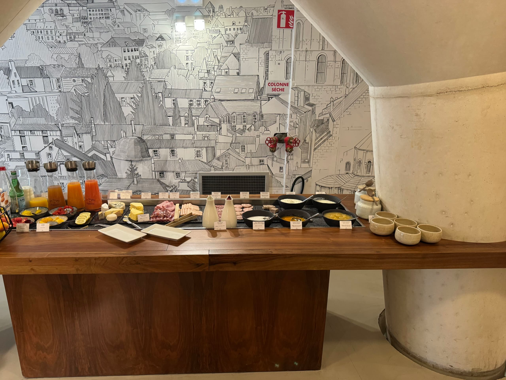

Le temps de flâner un peu dans le centre historique, et l'heure du rendez-vous approche.
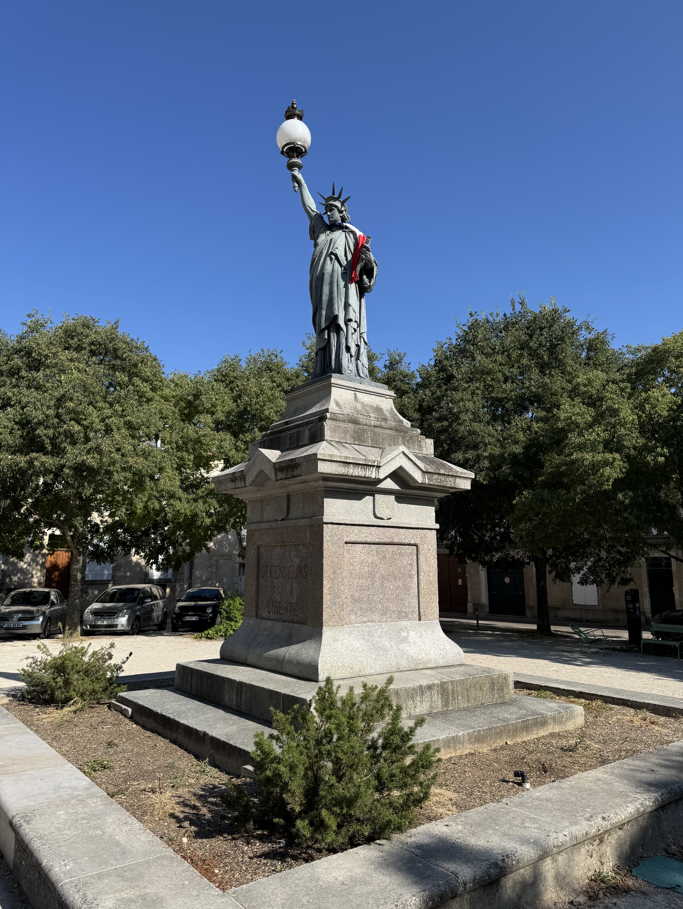
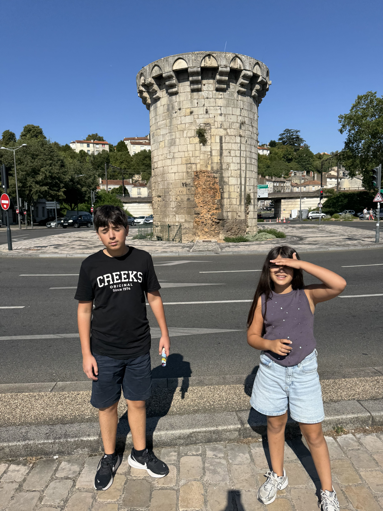
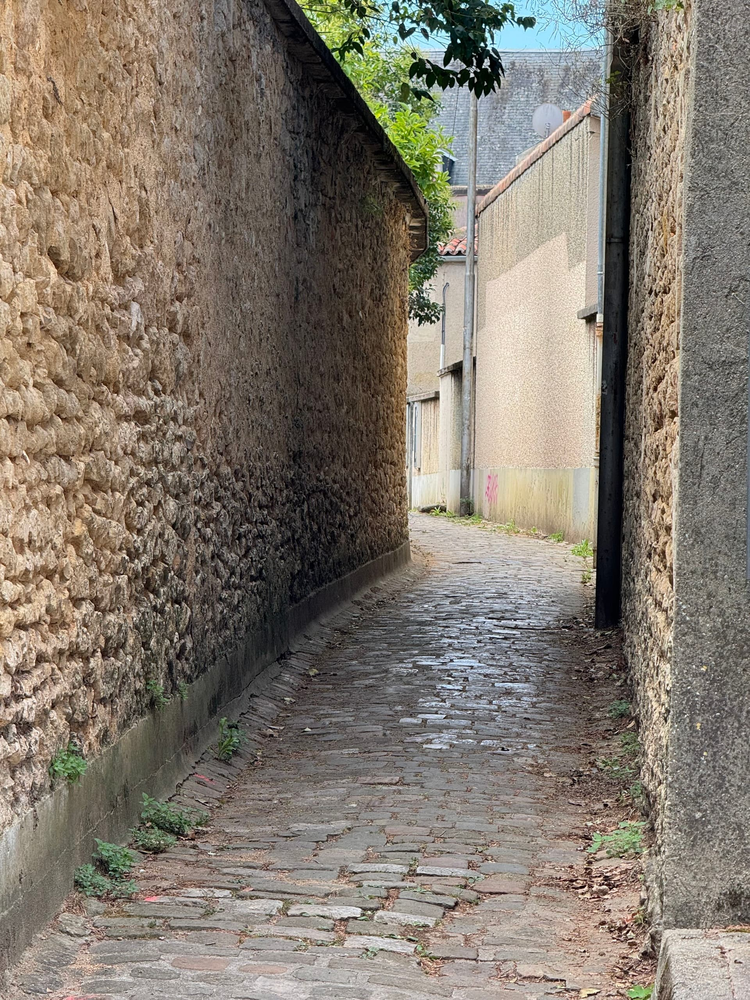
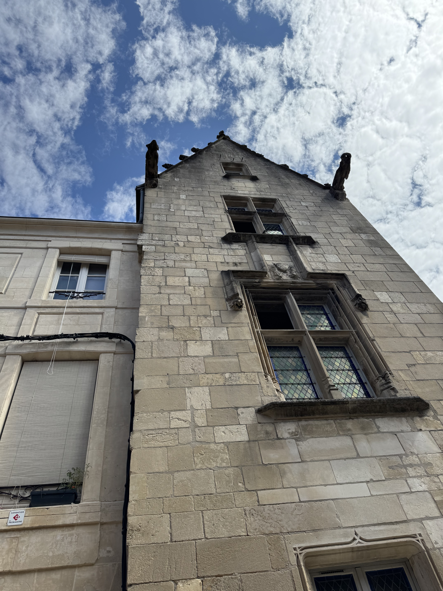
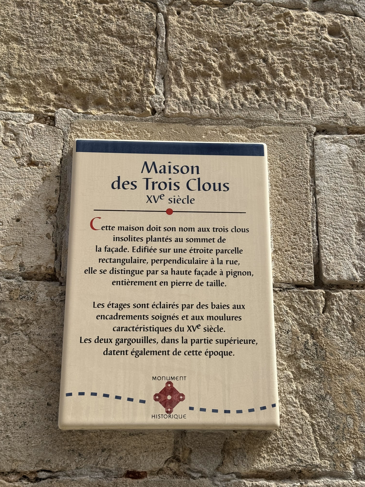

Notre-Dame-la-Grande est impressionnante
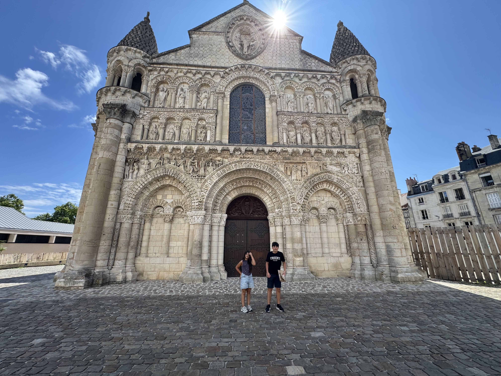

Ainsi que le palais des comtes de Poitiers qui proposait des ateliers créatifs
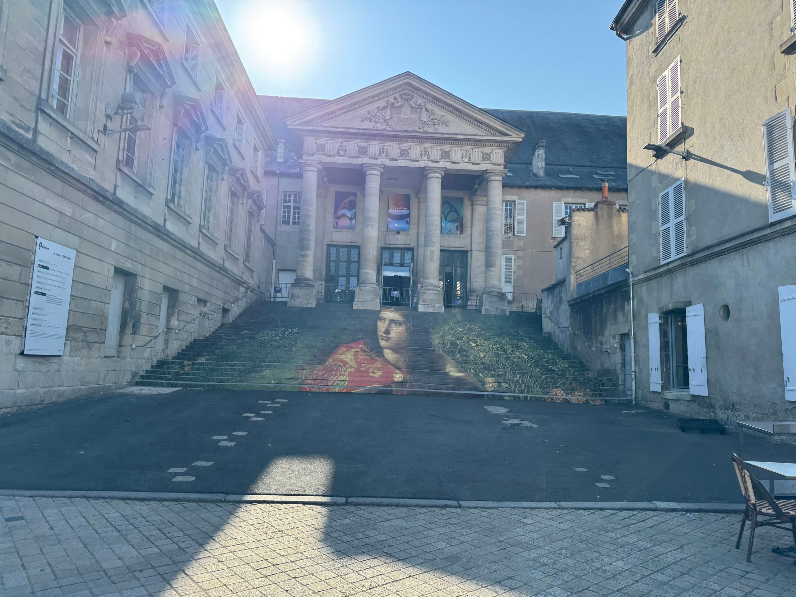

@video: ateliers.mp4

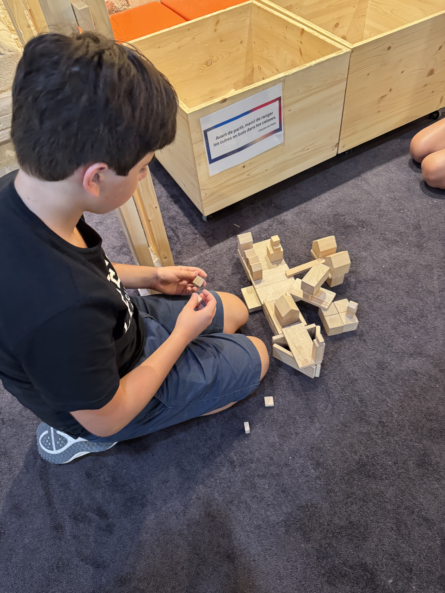

## Sensas

Dès l'entrée, le ton est donné : on nous confie à un guide, on abandonne repères et certitudes. Les salles s'enchaînent dans une obscurité totale, chacune sollicitant un sens différent. On rit, on sursaute, on hésite à poser le pied.

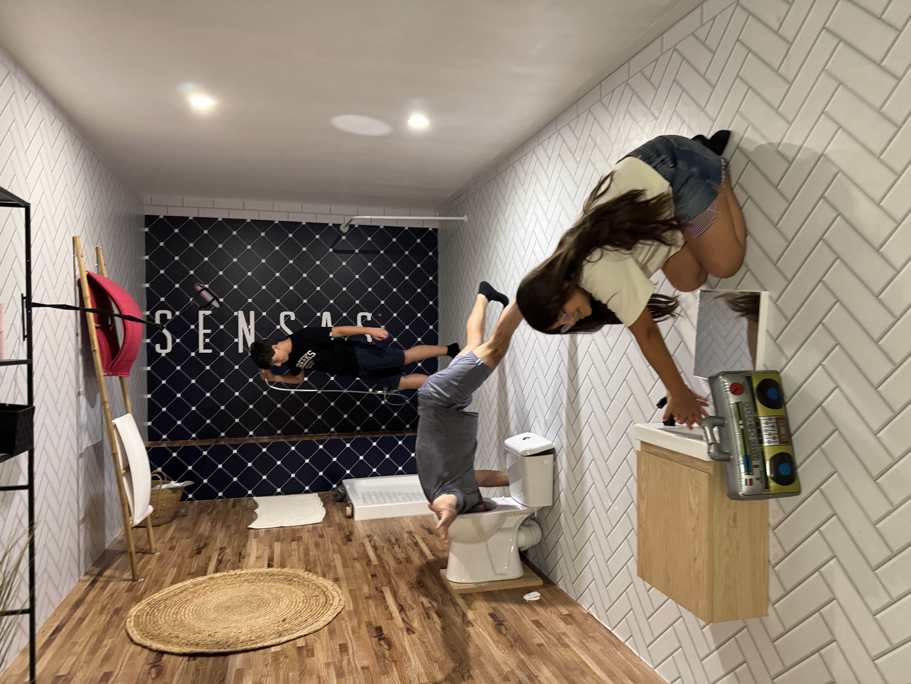

Difficile de tout raconter sans divulgâcher l'expérience — disons simplement qu'on ressort avec une conscience nouvelle de ce que nos yeux nous cachent d'habitude.

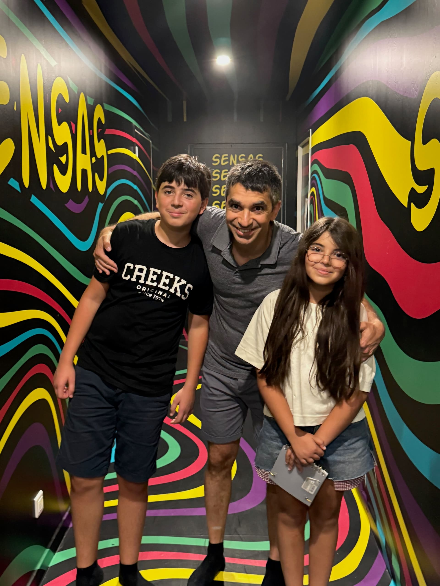

De retour à la lumière, un peu sonnés, on compare nos impressions : chacun a vécu le parcours différemment. Une belle mise en bouche avant les trois jours au Futuroscope qui nous attendent.
