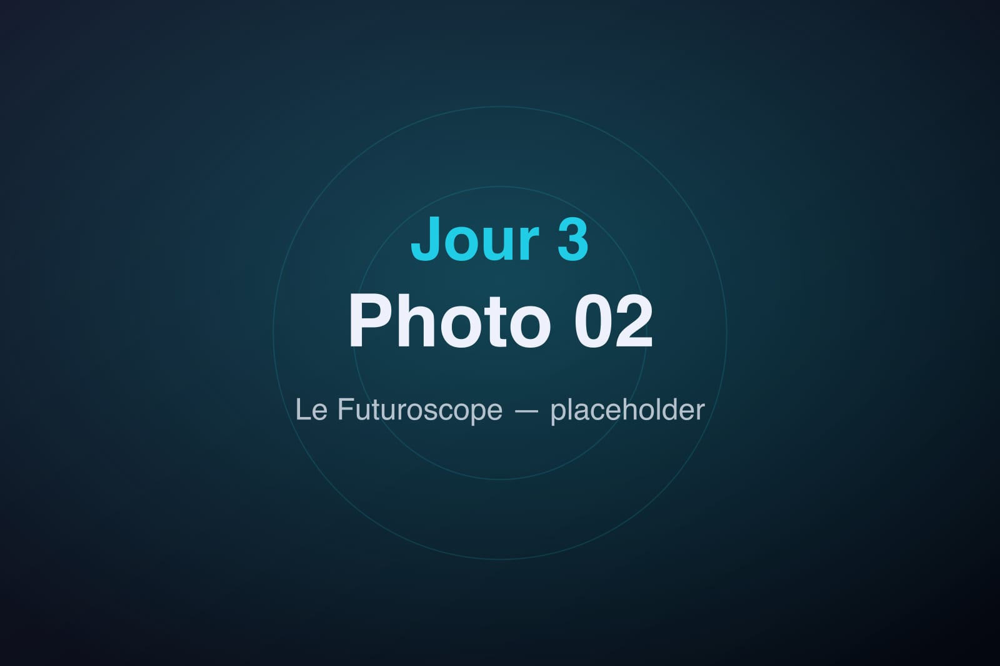
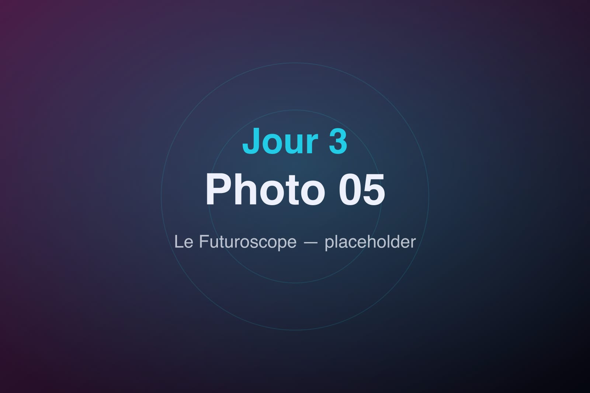

On change de camp de base : direction l'hôtel Cosmos, aux portes mêmes du Futuroscope, pour trois jours entiers de parc. L'excitation est à son comble.

## Hôtel Cosmos

L'arrivée à l'hôtel Cosmos donne le ton : couleurs vives, formes rétro-futuristes, tout ici évoque le voyage spatial. La chambre est un petit vaisseau douillet, et la proximité du parc — quelques minutes à pied — change tout.

On dépose les valises et on file, badge à la main, vers l'entrée du parc.

## Le Futuroscope

Le Kinémax nous accueille avec sa silhouette de cristal noir. On enchaîne les attractions phares, entre écrans géants, simulateurs et expériences immersives. Chaque pavillon est une porte vers un ailleurs : l'espace, les profondeurs, le futur des transports.

La journée file à toute allure. On coche les incontournables, on note ceux qu'on veut refaire, on savoure l'idée d'avoir encore deux jours devant nous.

Le soir venu, retour à l'hôtel Cosmos, la tête pleine d'images et les jambes lourdes. Demain, on remet ça — avec l'Aquascope en bonus.
