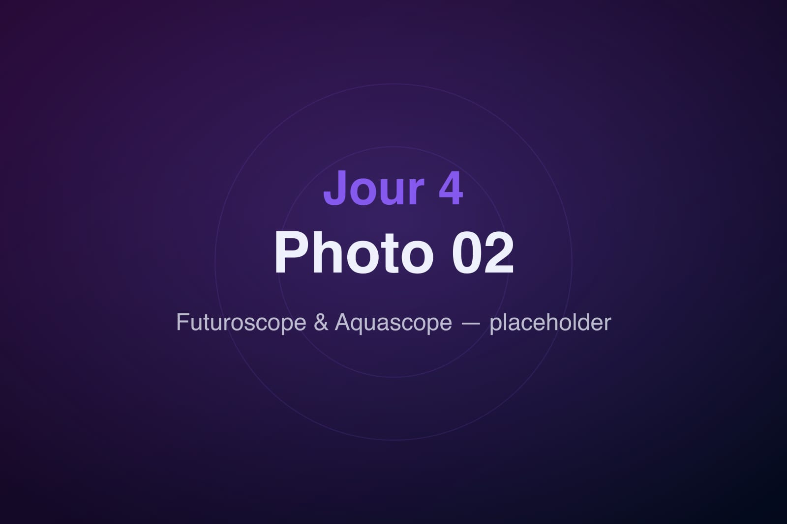
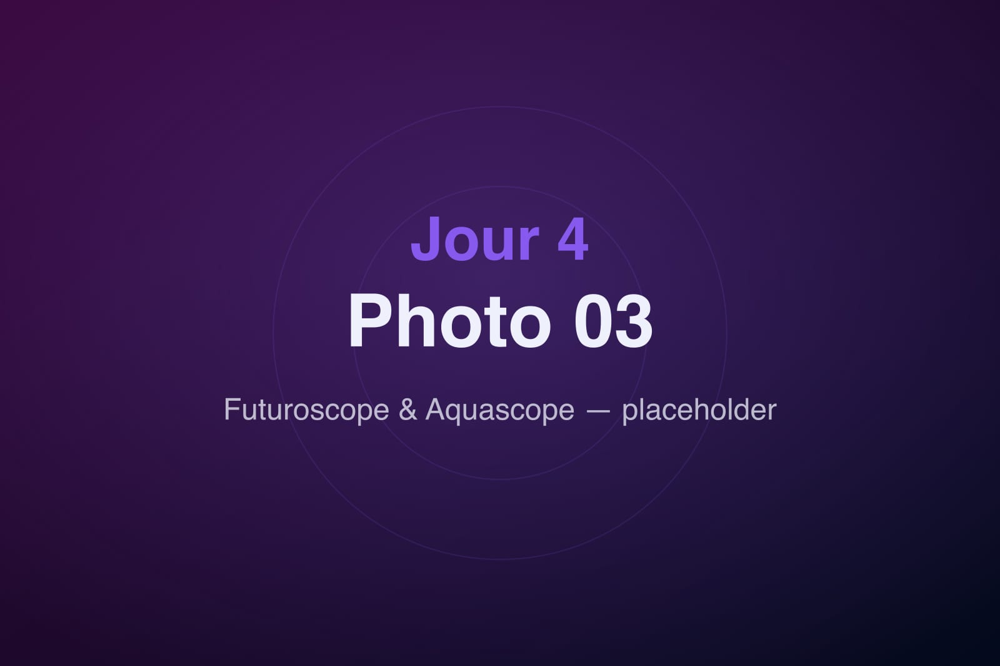

Deuxième journée au Futuroscope, avec un temps fort en fin de parcours : l'Aquascope, le nouvel univers aquatique, ouvert en nocturne de 17h à 22h.

## Space Loop

La journée commence en apesanteur — ou presque — au Space Loop, le restaurant spatial de l'hôtel. Petit-déjeuner sous les hublots, plateaux qui semblent flotter, café siroté face à un décor de station orbitale. De quoi démarrer la journée le sourire aux lèvres.

## Le Futuroscope

On retourne dans le parc pour les attractions qu'on avait gardées pour aujourd'hui. Le rythme est plus posé que la veille : on prend le temps, on refait nos préférées, on flâne entre les pavillons sous un beau soleil.

## L'Aquascope

En fin d'après-midi, place à l'Aquascope. Bassins, jeux d'eau, projections : à la tombée de la nuit, l'endroit se métamorphose. Les bulles montent dans la lumière, les couleurs se reflètent sur l'eau, et l'ambiance passe du bleu profond à un féérique spectacle nocturne.

On y reste jusqu'à la fermeture, à 22h, presque à regret. Une journée qui a commencé dans les étoiles et s'est terminée sous l'eau.
