Deuxième journée au Futuroscope, avec un temps fort en fin de parcours : l'Aquascope, le nouvel univers aquatique, en nocturne de 17h à 22h.

## Space Loop

La journée commence en apesanteur — ou presque — au Space Loop, le restaurant spatial de l'hôtel. Petit-déjeuner sous les hublots, plateaux qui semblent flotter, œuf au plat, saumon, croissants, chocolat chaud siroté face à un décor de station orbitale. De quoi démarrer la journée le sourire aux lèvres.

@video: petit-dej-cosmos.mp4

@video: petit-dej-cosmos1.mp4

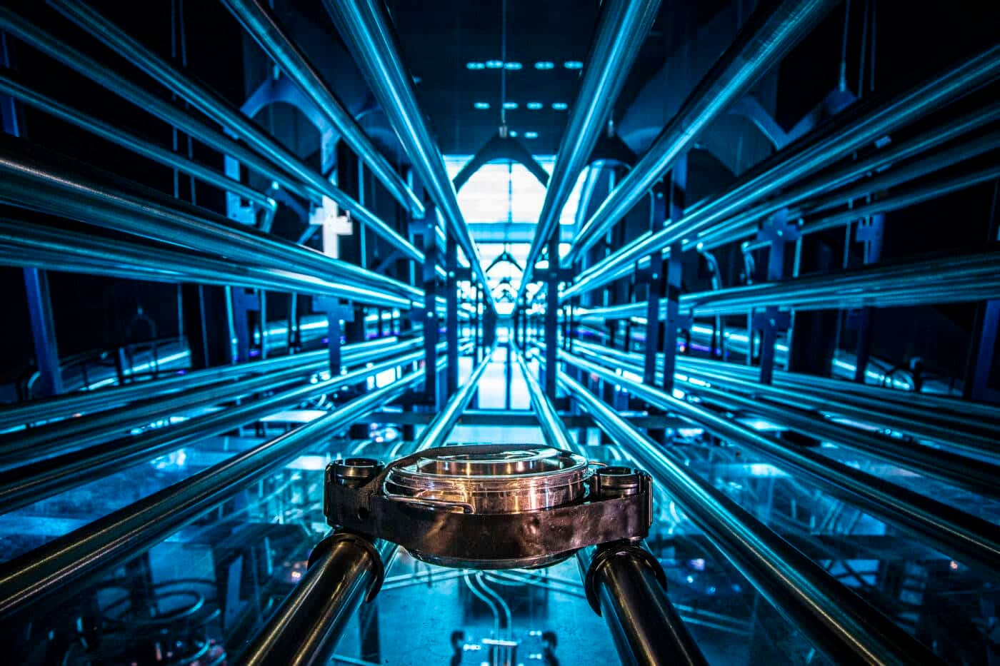
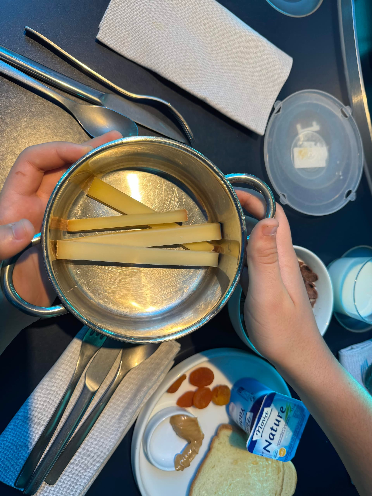

## Le Futuroscope

On retourne dans le parc pour les attractions qu'on avait gardées pour aujourd'hui. Le rythme est plus posé que la veille bien qu'il fasse toujours chaud. On refait nos préférées comme danse avec les robots (en mode expert 💪) et Objectif Mars 🚀.

### Danse avec les robots
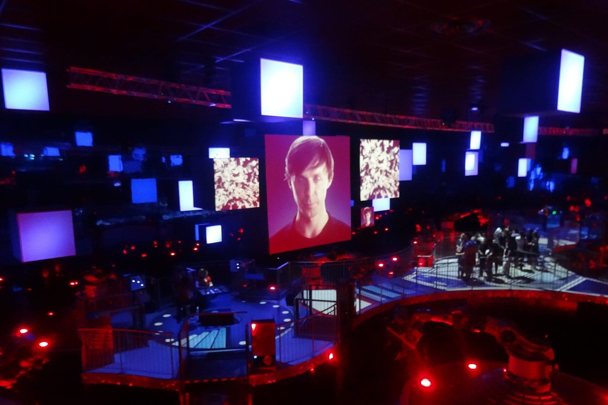

On en profite aussi pour faire la maison à l'envers avant les grosses chaleurs et la queue qui se forme rapidement à l'ouverture.

### Maison à l'envers
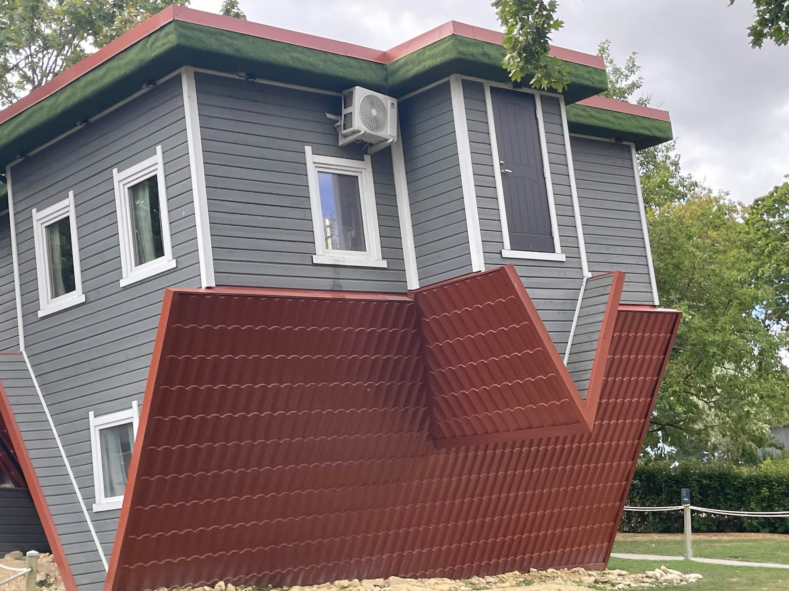
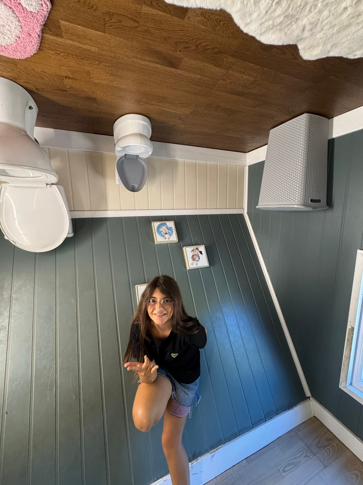
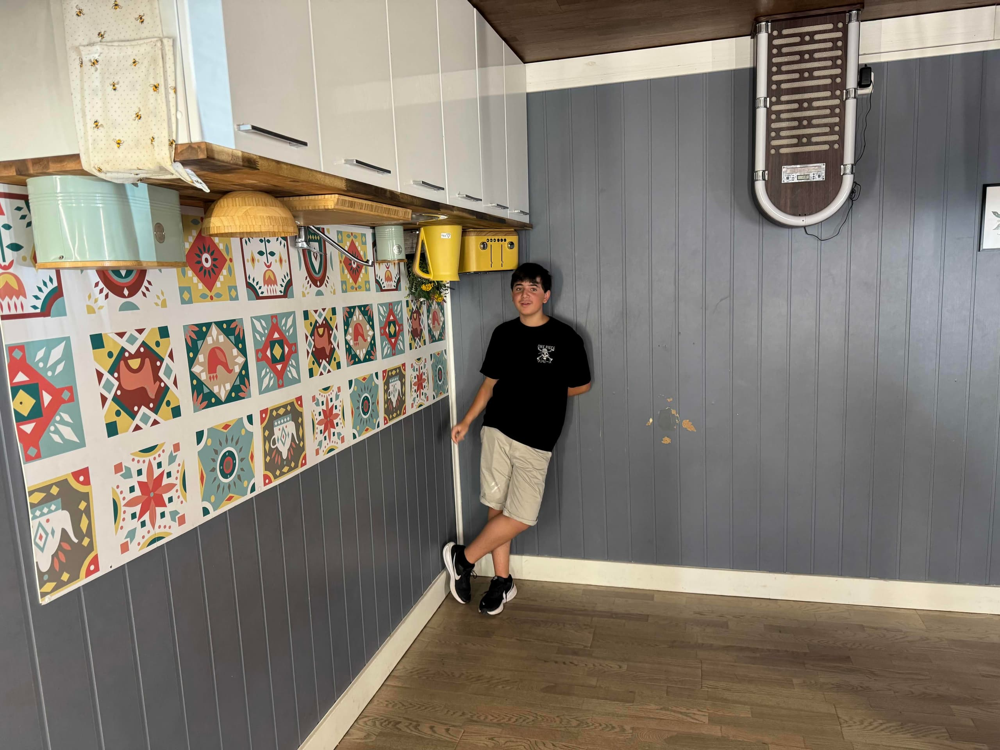

Puis on enchaîne avec d'autres attractions déjà faites la veille mais en intérieur comme T-rex 🦖 et étincelle ⚡️.

Petit cafouillage pour l'une des attractions phares : Mission Bermudes 🛶. Déjà en panne la veille, on attaque la queue de 30min sous un soleil de plomb en temporisant l'avancée de la queue pour rester au maximum à l'ombre.
Première déconvenue : l'attraction est en panne au bout de 15 minutes d'attente ... On patiente et 30min plus tard tout repart ! Cependant, à 10m des canoës de nouveau une panne. L'attente est longue, et au bout de 30 min l'annonce tombe au micro "Les techniciens mettent plus de temps à réparer sans délai annoncé, pour ceux qui le souhaitent vous pouvez emprunter les sorties pour profiter d'autres attractions".

On décide d'attendre, conscients que rien ne garantit que l'attraction fonctionnera le lendemain.
Heureusement, après quasiment 1h d'attente, l'attraction repart et on peut enfin en profiter !
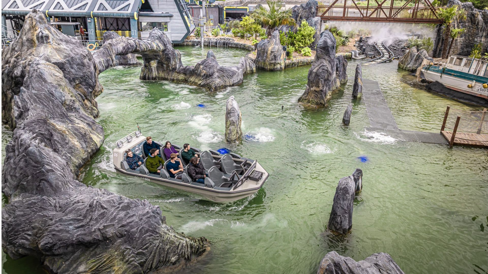
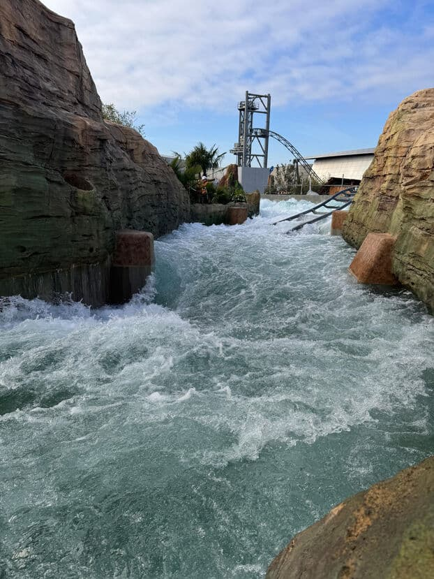

## L'Aquascope

En fin d'après-midi, pour tenir face à la chaleur écrasante, place à l'Aquascope. Bassins, jeux d'eau et tubes à sensations !

Les escaliers pour monter aux différents tubes. Il y en a une dizaine, certains nécessitent une bouée, d'autres un tapis, d'autres encore aucun accessoire à part un cœur bien attaché :)
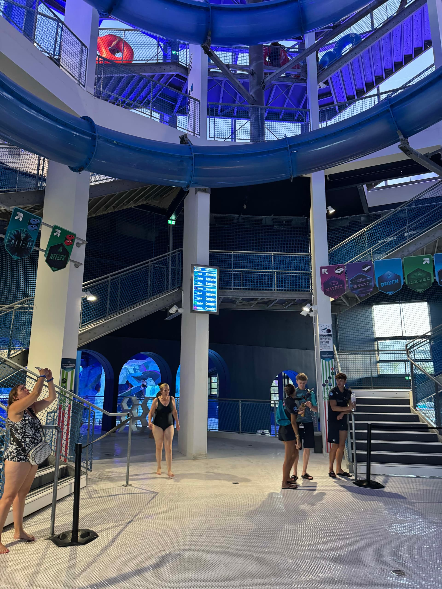
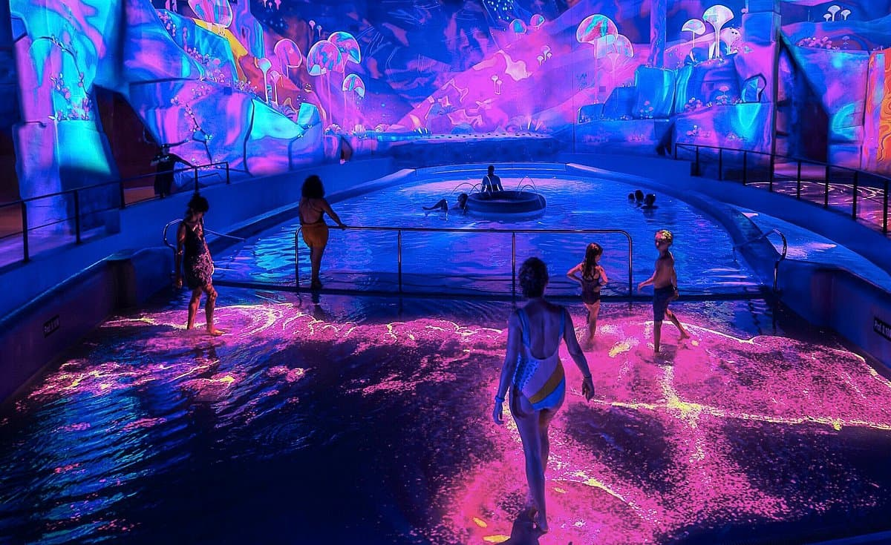

L'Aquascope propose aussi 3 projections interactives (qui génèrent des jets d'eau ou de la lumière qui réagit aux mouvements) ainsi que des activités plus douces comme un parcours à bouée qui fait le tour de l'Aquascope.
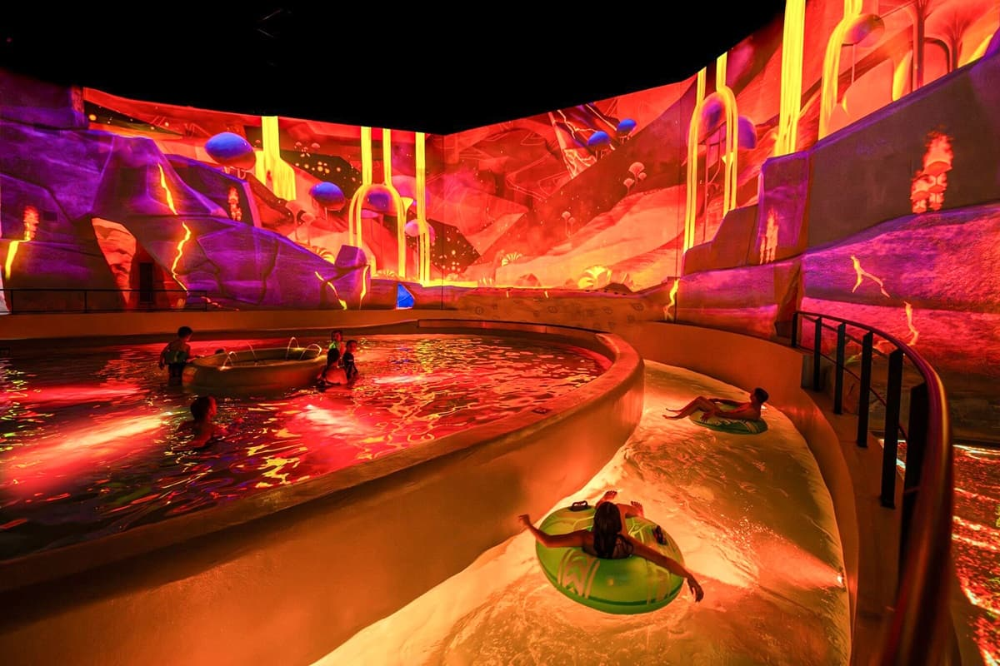

On y reste jusqu'à la fermeture, à 22h, le temps d'avaler un sandwich juste avant la fermeture des restaurants. Dommage que les tubes ferment plus tôt pour prendre en compte la queue encore présente à cette heure tardive.

Une journée qui a commencé dans les étoiles et s'est terminée sous l'eau 😅.
