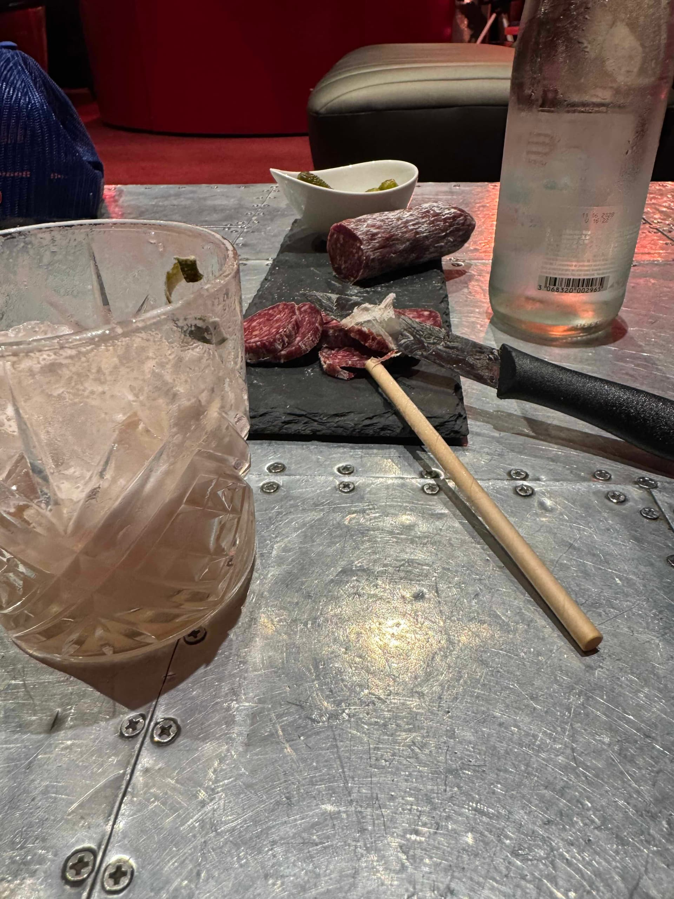
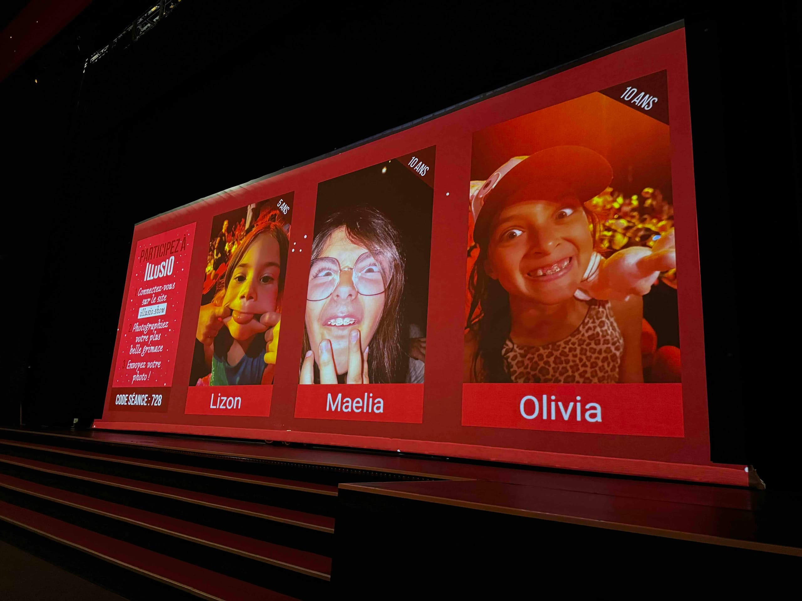
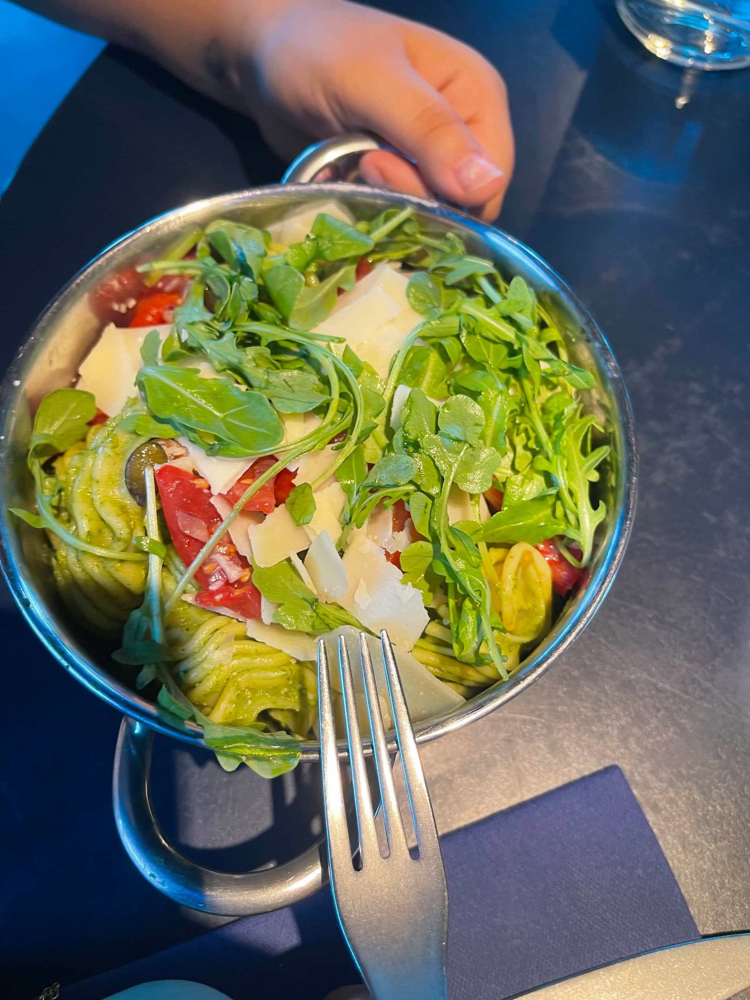
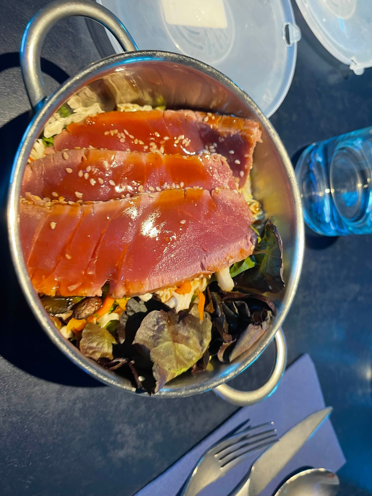
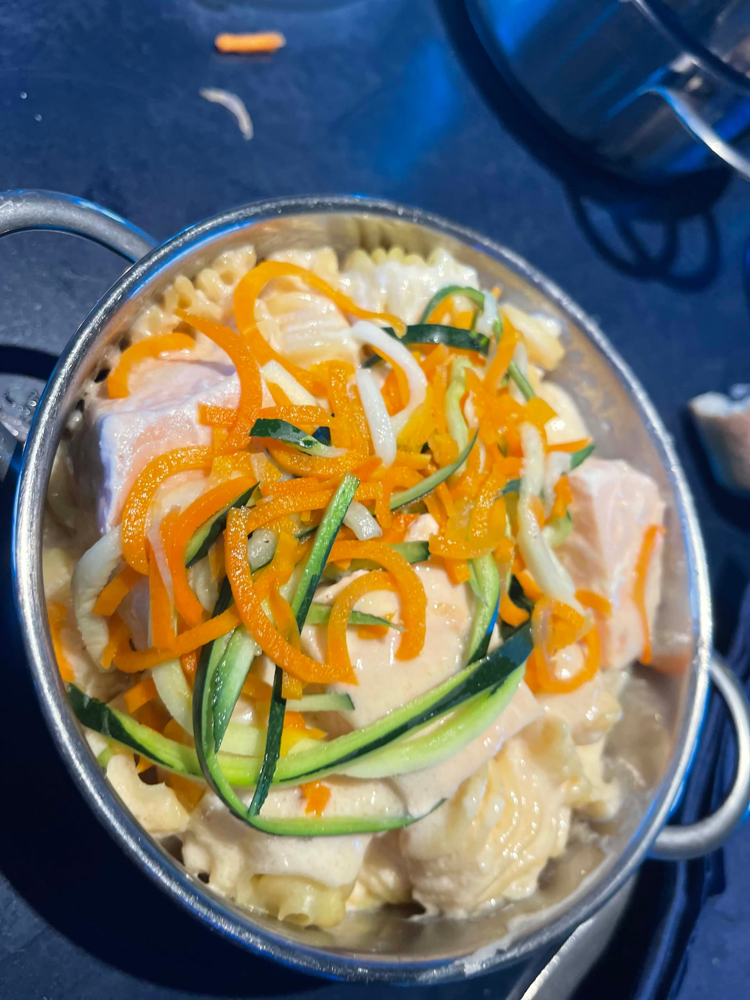
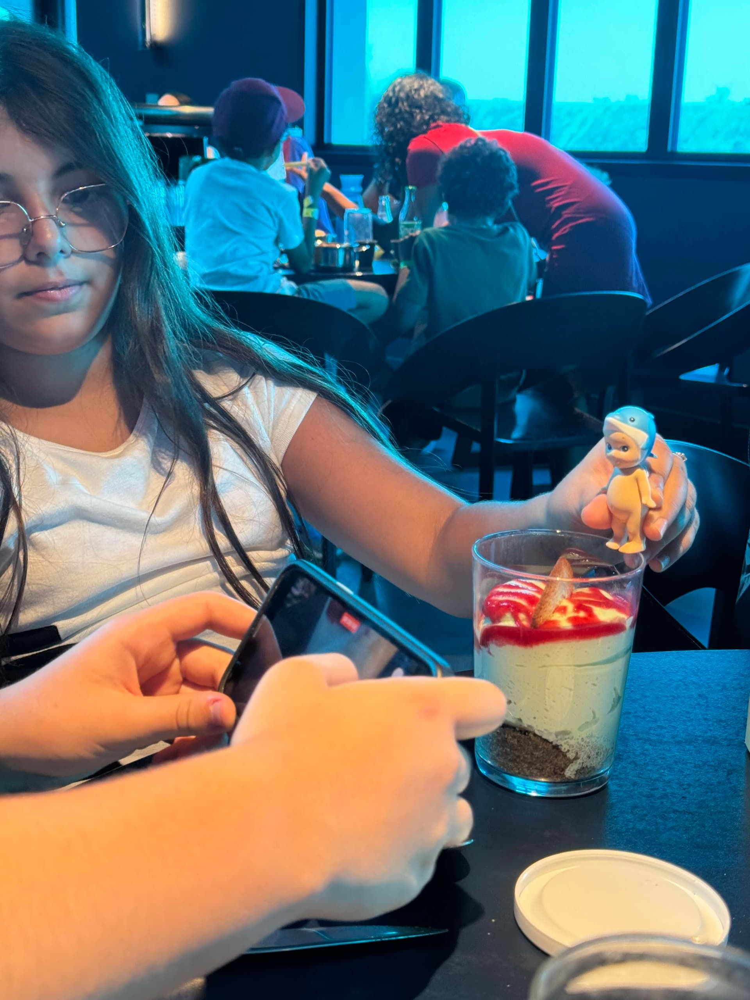

Troisième et dernier jour au Futuroscope. On connaît le parc par cœur maintenant, alors on se fait plaisir : les coups de cœur en priorité, sans se presser, avec cette petite pointe de nostalgie de ceux qui savent que ça se termine.

On profite des files plus courtes du matin pour refaire mission to mars, danse avec les robots.

@video: danse-robots.mp4

Puis on part à la découverte des recoins qu'on n'avait pas encore explorés comme le splash qui fonctionne en toute autonomie : le passager s'installe et ferme la barrière, celui qui attend derrière appuie sur un bouton et le passager n'a plus qu'à tirer une corde 2 fois pour que l'attraction démarre.

@video: attraction-splash.mp4

On fait une petite pause pour goûter un saucisson au bœuf autour d'un dernier verre au bar des pilotes

On prend le frais au spectacle de magie où on doit envoyer sa meilleure grimace pour finir sur scène

Un dernier tour et on file le soir pour manger une dernière fois à Space Loop

On sort du restaurant prêt à partir et là on se regarde et on se dit "une dernière attraction ?".
Un regard rapide pour voir que Mission Bermudes est ouvert avec moins de 15min de queue ! C'est parti pour cette dernière attraction avant de prendre la route pour la suite de notre voyage : green hotel pour ce soir et le Clos de la Ribaudière les 2 prochains jours.