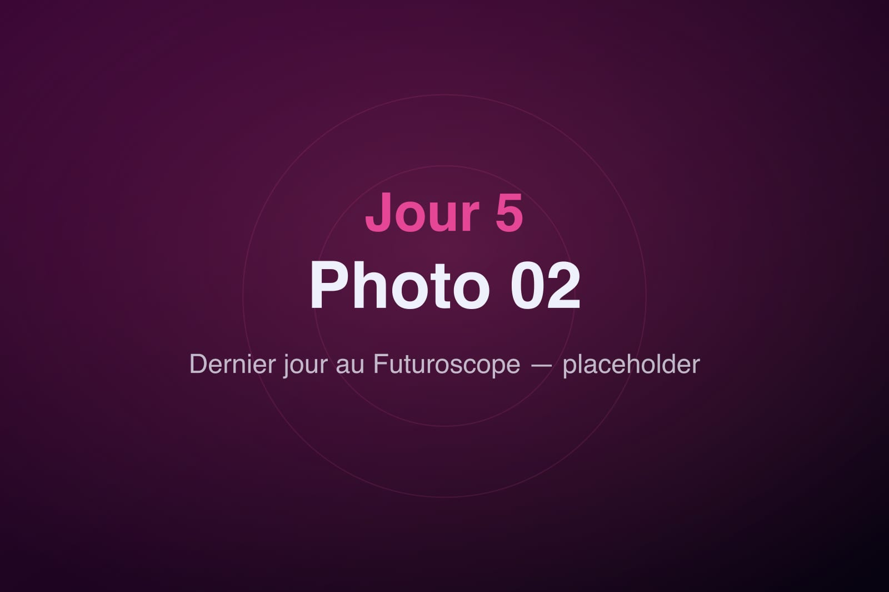
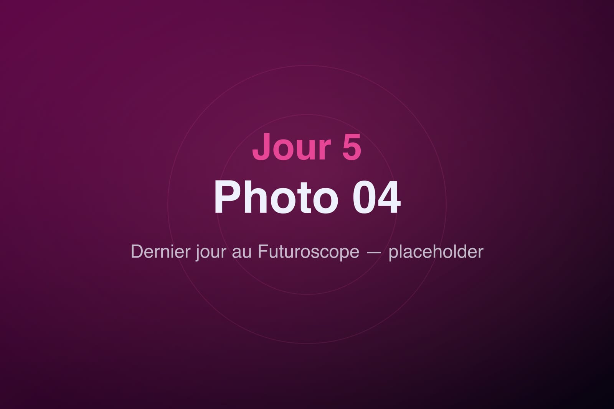

Troisième et dernier jour au Futuroscope. On connaît le parc par cœur maintenant, alors on se fait plaisir : les coups de cœur en priorité, sans se presser, avec cette petite pointe de nostalgie de ceux qui savent que ça se termine.

On profite des files plus courtes du matin pour refaire les simulateurs qu'on avait adorés, puis on part à la découverte des recoins qu'on n'avait pas encore explorés. Un dernier tour de manège, une dernière séance sur écran géant, un dernier passage à la boutique pour ramener un souvenir.

À mesure que le jour décline, le parc se pare de ses habits de lumière. On garde le meilleur pour la fin : le grand spectacle nocturne, sur le lac, qui mêle projections, lasers et fontaines dans une chorégraphie à couper le souffle. Les couleurs dansent comme une aurore artificielle au-dessus de l'eau.

Quand les dernières lumières s'éteignent, on quitte le parc en silence, des étoiles plein les yeux. Trois jours au Futuroscope, et déjà l'envie de revenir. Demain, cap sur la douceur du Clos de la Ribaudière.
