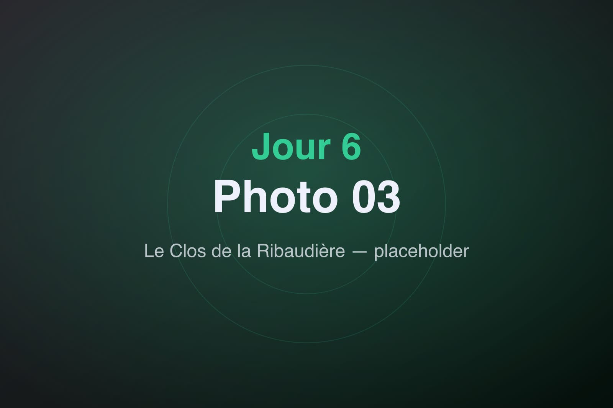
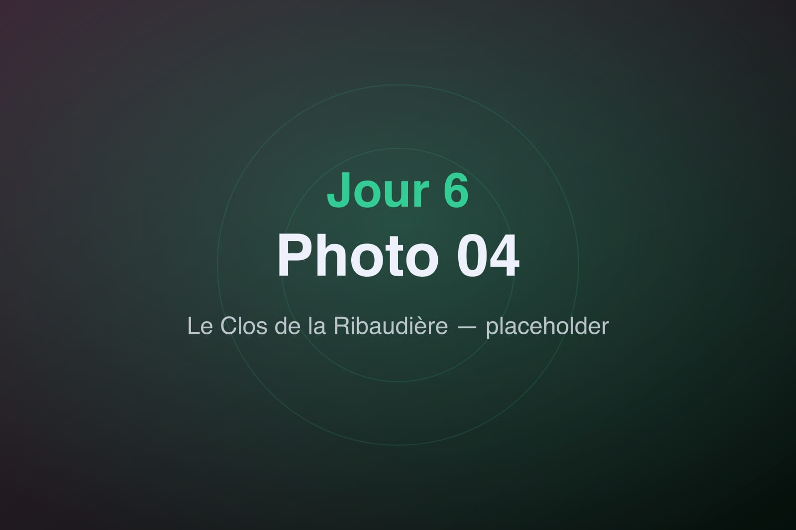

Changement complet de rythme. Après l'effervescence du parc, on s'offre une journée au ralenti au Clos de la Ribaudière, une demeure de charme nichée dans la verdure — et son SPA.

## Le Clos de la Ribaudière

L'arrivée est un enchantement : une bâtisse en pierre, un parc ombragé, le chant des oiseaux pour seule bande-son. La chambre respire le calme, la vue donne sur le jardin. On sent déjà les épaules qui se relâchent.

On prend le temps d'un déjeuner tranquille avant de céder à l'appel du SPA.

## Le SPA

Vapeur, eau chaude, lumière tamisée : le SPA est une bulle hors du temps. On alterne bassin, sauna et moments de pure oisiveté, l'esprit vidé, bercé par le clapotis et les ondulations lentes de l'eau.

La journée s'étire, délicieusement lente. On ressort de là comme neufs — le contrepoint parfait aux trois jours d'attractions. Demain, une dernière escapade nature nous attend à la Vallée des Singes.
