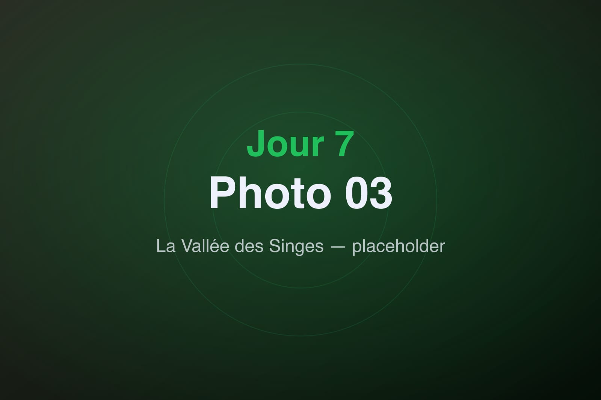
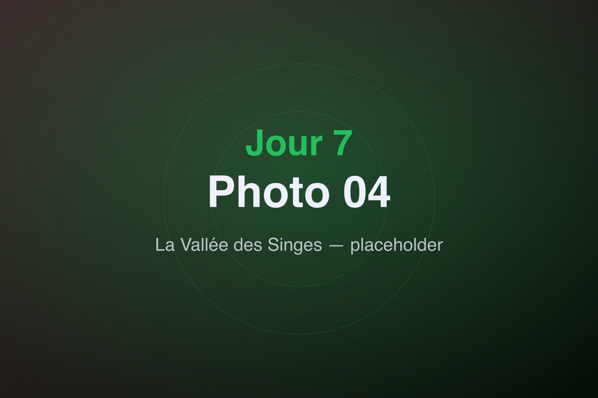

Avant-dernier jour, et une visite qu'on attendait tous : la Vallée des Singes, à Romagne, où les primates évoluent en semi-liberté au milieu d'un immense parc boisé. Ici, ce ne sont pas les animaux qui sont en cage — c'est nous qui traversons leur territoire.

Dès l'entrée, le ton est donné : des îles, des allées ombragées, et des singes partout autour de nous, sans barrière. On avance doucement, à hauteur de gibbons acrobates qui filent d'arbre en arbre au-dessus de nos têtes.

Plus loin, les lémuriens se prélassent au soleil, les chimpanzés s'observent en famille, les bonobos jouent. On s'assoit, on regarde, on oublie l'heure. Chaque espèce a son caractère, ses interactions, ses petites histoires qui se jouent sous nos yeux.

Le parc invite à la lenteur et au respect. On repart en fin d'après-midi, ravis de cette immersion, avec le sentiment rare d'avoir été les invités et non les spectateurs. Il ne reste plus qu'une étape : la route du retour vers Lyon.
