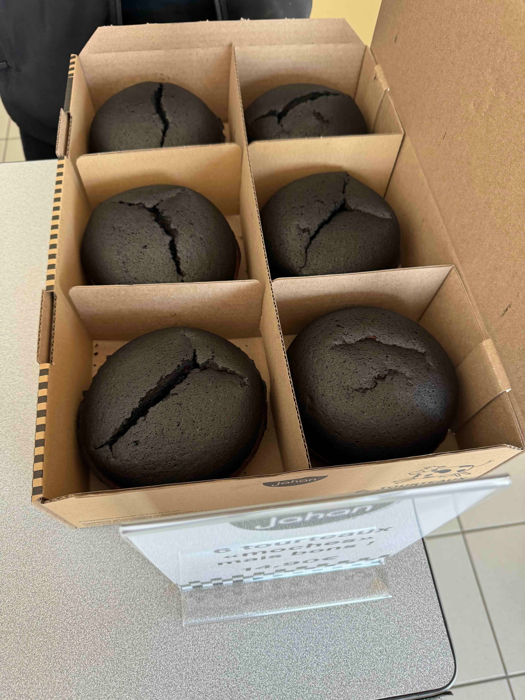
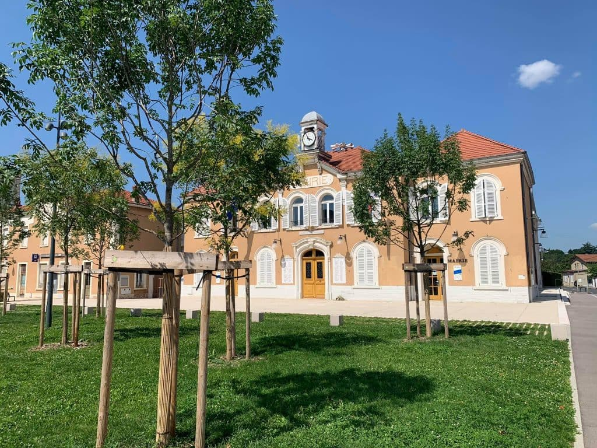

Dernier jour. On boucle les valises une dernière fois, un peu nostalgiques, et la Tesla reprend la route — en sens inverse, cette fois. Poitiers derrière nous, Lyon au bout du chemin.

Le voyage retour a une saveur particulière. On rembobine la semaine à voix haute : le silence de la première borne de recharge, les couloirs noirs de Sensas, les trois jours au Futuroscope, les bulles de l'Aquascope, la vapeur du SPA, les gibbons dans les arbres. Huit jours qui, mis bout à bout, forment déjà un beau souvenir.

Avant toute chose, un arrêt pour acheter la spécialité locale : le tourteau fromager

Les kilomètres défilent, l'autonomie se gère désormais les yeux fermés — l'électrique nous a définitivement convaincus. L'arrêt est fait sur une aire d'autoroute avec moins de 5min d'attente annoncée.
À l'approche de l'aire, on s'inquiète, la queue à la pompe est grande et pour facilement plus de 10min.
On tourne vers les bornes Tesla, toutes pleines et je commence à douter de l'outil de planification de la Tesla.
À cet instant, une voiture sort de sa place de recharge : top ! On va pouvoir laisser la voiture charger quand côté essence ils sont encore dans la queue 😜.
Un rapide sandwich et on repart en direction de Lyon. 

Le soleil descend sur l'horizon et nimbe l'autoroute d'une lumière dorée, comme un générique de fin qui se déroulerait juste pour nous.

On se gare enfin devant chez nous, huit jours après en être partis à l'aube. Les valises sont plus lourdes, la tête est pleine, et déjà une question flotte dans l'air : c'est quand, la prochaine ?
Le propriétaire de la voiture est là, on fait un dernier tour de contrôle et on se dit au revoir.

Il repart avec cette voiture qui nous a totalement convaincus ... un jour peut-être nous en aurons une ...