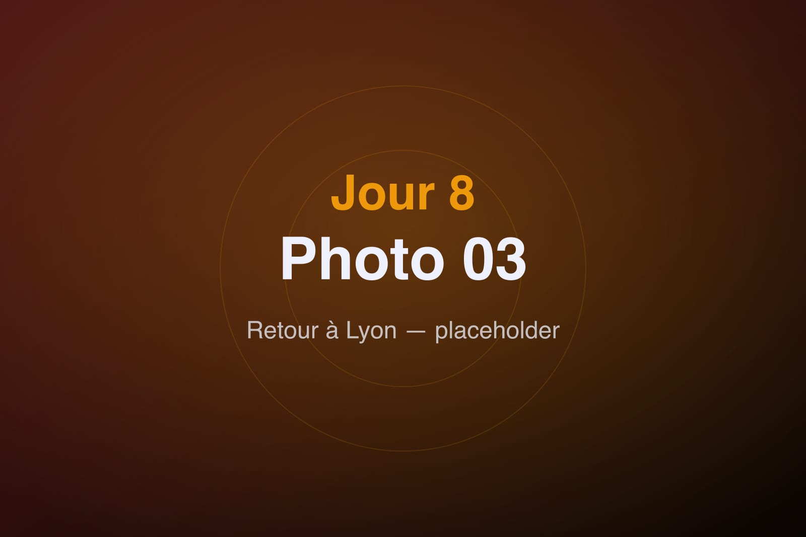

Dernier jour. On boucle les valises une dernière fois, un peu nostalgiques, et la Tesla reprend la route — en sens inverse, cette fois. Poitiers derrière nous, Lyon au bout du chemin.

Le voyage retour a une saveur particulière. On rembobine la semaine à voix haute : le silence de la première borne de recharge, les couloirs noirs de Sensas, les trois jours au Futuroscope, les bulles de l'Aquascope, la vapeur du SPA, les gibbons dans les arbres. Huit jours qui, mis bout à bout, forment déjà un beau souvenir.

Les kilomètres défilent, l'autonomie se gère désormais les yeux fermés — l'électrique nous a définitivement convaincus. À l'approche de Lyon, le soleil descend sur l'horizon et nimbe l'autoroute d'une lumière dorée, comme un générique de fin qui se déroulerait juste pour nous.

On se gare enfin devant chez nous, huit jours après en être partis à l'aube. Les valises sont plus lourdes, la tête est pleine, et déjà une question flotte dans l'air : c'est quand, la prochaine ?
